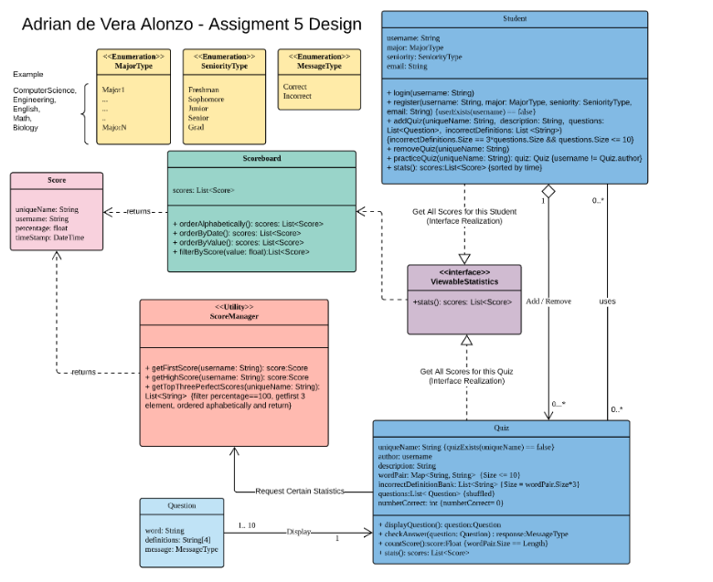
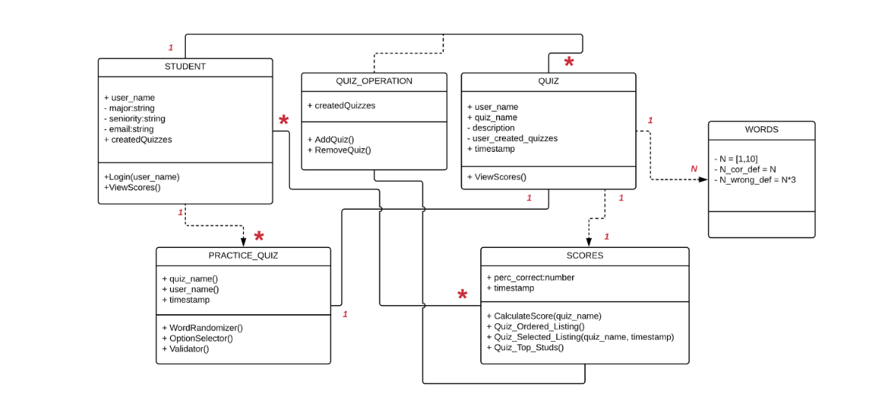
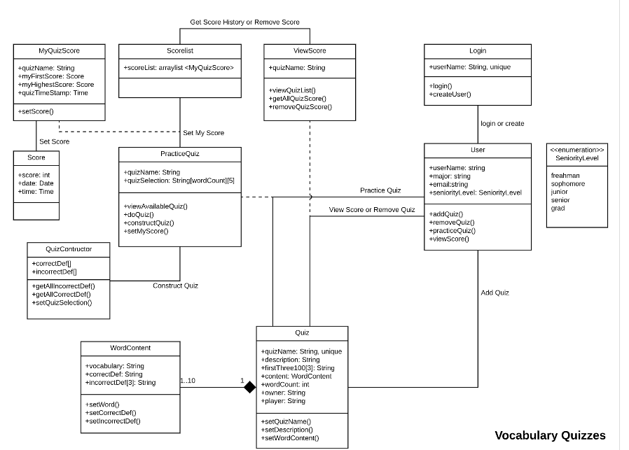
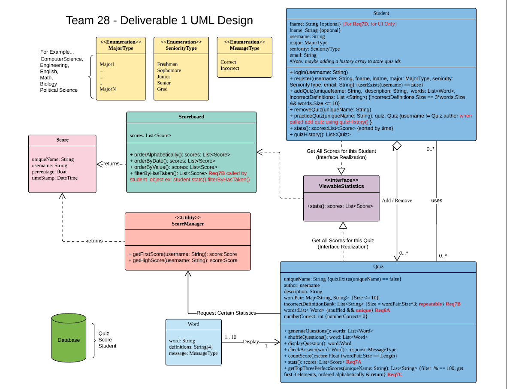

# Design Discussion

## 8a) Individual Designs - Pros and Cons

### Design 1 - Adrian

#### Pros

- Enums; Created an interface for the score object - which was able to be called from both the Quiz and the Student, making it more flexible
- Includes very clear details for each object’s methods. Method input type, return type, and constraint are listed in detail.
- Uses a utility class for returning specific statistics

#### Cons

- Limited flexibility when concerned with individual class methods like practiceQuiz() and creating a separate Quiz object
- Repeats redundant score data across student and quiz separately

### Design 2 - Oindril

#### Pros

- Simplifies everything to Strings; Quiz is just collection of Words/Scores
- Makes it easy to clean up when deleting a quiz
- The relationships between classes are precise

#### Cons

- Too Simple which causes difficulty following design logic; No enums
- Brings redundancy to Word and Score data
- Lacked randomizing words functionality and the way in which the incorrect definitions were picked
- A record for first three students getting 100% score is missed. 
- Lacks constraints which could be used to better display design intent

### Design 3 - Sriram

#### Pros

* Included flexibility in the design to accommodate for different methods in the practiceQuiz class 

* Included relation class for student and quiz 

#### Cons

* Lacking in some basic functionality like working with the score object
* Some methods/classes are too vague and did not include return type
* Very complicated relation mapping  between classes
* Lacks explicit method and variable constraints which could provide more information of designs intent
* Lack of relationship explanation between classes.

### Design 4 - Wong

#### Pros

- Exploits good use of helper methods for manipulating each object
- Uses good use of enumeration
- Classes are well broken down in an OOP manner

#### Cons

- Does not have any return types for methods that would otherwise make design logic more clear
- Lacks some constraints which make design 
- May be difficult accessing each specific score by a certain user
- Missing class relationships

## 8B) Team Design

***Newly added requirements are shown in red in the design***

### Similarities to Individual Designs

- Follows the use of an enumeration pattern
- Exploits interface making scores easily accessible through either quiz or student objects
- UML diagram is modified and expanded from design 1.
- Extensive usage of helper methods
- Included proper return types for methods involved

#### Features Unique to New Design:

- Included the option for a student to choose between using his/her username or real names
- Each user contains a quiz history associated to them
- Has filtering methods within the scoreboard class for the quizzes each student has not taken and included a variable within the student class which kept a history of the quizzes already taken as an array
- Included option for the incorrect definitions to be able to repeat as wrong answer choices for multiple words
- For improved functionality, practiceQuiz method includes a quizHistory as an additional argument
- Added the requirement that the questions in the quiz are unique i.e. the words only occur once as a question
- Improved functionality of Quiz class. Helper methods added for generate and shuffle quiz question. 

## 8C) Summary

- Realized the importance of using enumerations in the design to make it more flexible
- A major help to include helper methods explicitly rather than keeping them implicit
- Had to choose important features from individual designs and incorporate them all into one without losing any functionality 
- Providing the method’s return type so that the intended logic flow is clear
- Remove redundant methods between classes
- Need to find an acceptable level of modularity to prevent objects from becoming too dependent upon another; selective inheritance is ideal
