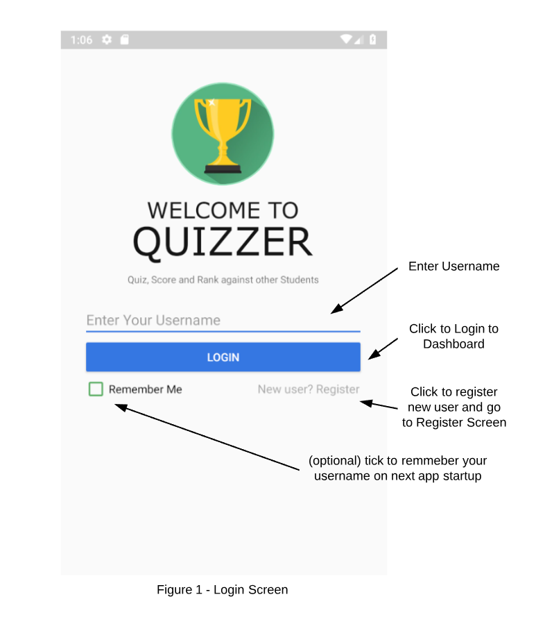

# SPDVocabQuiz User Manual

## Operation Platform
Android 6.0 or later version

## Creating a User
- Start up the app to navigate to the *Login* page shown in figure 1.
- Click **New user? Register** to *Register* page shown in figure 2.
- Enter in the desired user information and click **Register** to confirm.
Note: **Username** can not be empty and duplicated with other user. Error message will pop up if **Username** is invalid and registration will be blocked.  

## Logging In
- Navigate back to the login screen
- Enter valid user name in **Enter Your Username** in **Login**page.
- If **Remember me** is checked, **User name** will automatically be entered on next application startup/restart.
- Click **LOGIN** to enter ** Dashboard ** page shown in figure 3. Incorrect usernames will result in an error.

## Dashboard (Homepage)
- In **Dashboard** page shown in figure 4, all quizzes in the system will be displayed in a list. Quizzes created by the current user will be listed on the top without any score and a Quill icon beside the name. Quizzes created by other users are listed after. Clicking on a quiz to practice. User highest score of the quiz is shown on the right side . To create a quiz click on the **+** button located at the bottom right corner.

## Creating a Quiz
### Going to the Quiz Screen
- Navigate to the **Dashboard** screen shown in Figure 3.
- Select the Blue Button at the bottom right of the screen to navigate to the **Quiz Creation** screen shown in Figure 4.
### Entering Quiz Details
The information below follows Figure 4.
- Enter a quiz name (this must be unique)
- Enter a short brief description about your quiz
- Enter the word with its definitions
- More words can be added by selecting the **Add Word** button shown in Figure 4. (Note: Maximum of 10 words)
- Now enter the incorrect definitions (these will be independent from the words above)
- To complete click on the Green Button at the bottom right corner shown in Figure 4.
- A pop up notification will appear to confirm or go back and edit the quiz.
- Upon confirmation you will return back to the dashboard. You will see your quiz with the information you provided and a **Quil** icon to denote you are the author. (Note: Users can only practice quizzes they do not have a **Quil** icon / are not the author)

## Deleting a Quiz
Note: To delete a quiz you must be the author (have a Quill beside the quiz’s name you wish to delete. Deleting a quiz will permanently remove it and the associated scores. This action cannot be undone.
- Navigate to the **Dashboard** screen shown in Figure 3
- Find a quiz you want to remove that has a **Quil** icon next to it
- Swipe right on that quiz to delete it

## Selecting a Quiz
Note: You cannot practice your own quizzes. You must practice quizzes made by other users.
- Navigate to the Dashboard screen shown in Figure 3
- Find the quiz you want to practice (does not have a **Quill** Icon)
- Tap on the Quiz to open more Info about it

## Practicing a Quiz
- When practicing a quiz the user will be greeted with a screen containing a Vocab word, the current and total number of words, set of definitions.
- Selecting a definition will instantly evaluate by displaying a **Correct** or **Incorrect** and Next button to go to the next vocab word
- Repeat this process until we reach the end where finally clicking **Next** will take us to a results screen displaying statistics of other students and your scores

## View Score Statistics
- Navigate to the **Dashboard** where there is a list of quizzes
- Tap on a quiz to reveal a green pop with the quizzes information as well as the Statistics
- Stats shown are High score and First score of the user as well as the Top 3 High Scorers
//Insert image for Score Stats ViewResultsQuiz.png
